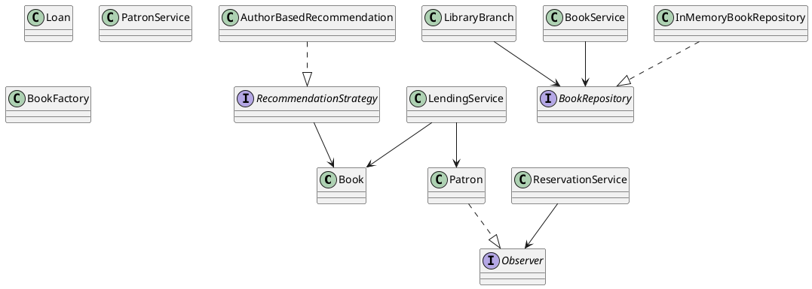

# 📚 Library Management System (Java - Low Level Design)

A fully interactive, console-based Library Management System implemented in Java.  
This project demonstrates strong Object-Oriented Design, SOLID principles, and multiple design patterns.

---

## 🚀 Features

### 🏢 Multi-Branch Support
- Add new branches dynamically
- Switch between branches
- Each branch maintains its own book inventory

### 📘 Book Management
- Add books
- Search by:
    - Title
    - Author
    - ISBN
- Branch-specific inventory tracking

### 👤 Patron Management
- Add new patrons
- Maintain borrowing history

### 🔄 Lending System
- Checkout books
- Return books
- Active loan tracking

### 🔔 Reservation System
- Reserve books
- Notify patrons when books become available
- Implemented using **Observer Pattern**

### 🎯 Recommendation System
- Author-based recommendations
- Implemented using **Strategy Pattern**

### 🏭 Factory Pattern
- Book creation handled via `BookFactory`

### 📝 Logging
- Implemented using `java.util.logging`
- Logs important operations:
    - Book additions
    - Checkout
    - Returns
    - Errors
- Centralized logging configuration

---

## 🧠 Design Patterns Used

| Pattern      | Usage |
|-------------|--------|
| Factory     | Book object creation |
| Observer    | Reservation notification |
| Strategy    | Recommendation system |
| Repository  | Data abstraction |

---

## 🧩 SOLID Principles Applied

- **S** – Single Responsibility
- **O** – Open/Closed
- **L** – Liskov Substitution
- **I** – Interface Segregation
- **D** – Dependency Inversion

---

## 🗂 Project Structure

```
library-management-system
│
├── model
│   ├── Book.java
│   ├── BookStatus.java
│   ├── Patron.java
│   ├── Loan.java
│   └── LibraryBranch.java
│
├── repository
│   ├── BookRepository.java
│   └── InMemoryBookRepository.java
│
├── service
│   ├── BookService.java
│   ├── PatronService.java
│   ├── LendingService.java
│   └── ReservationService.java
│
├── strategy
│   ├── RecommendationStrategy.java
│   └── AuthorBasedRecommendation.java
│
├── factory
│   └── BookFactory.java
│
├── observer
│   └── Observer.java
│
├── util
│   └── LoggerConfig.java
│
└── Main.java
```

---

## 🖥 Interactive CLI Menu

```
===== LIBRARY SYSTEM =====
1. Add Branch
2. Switch Branch
3. Add Book
4. Search Book
5. Add Patron
6. Checkout Book
7. Return Book
8. Reserve Book
9. Recommend Books
10. Exit
```

---

## 📊 Class Diagram (PlantUML)

You can render this using https://plantuml.com/



---

## ▶️ How to Run

1. Clone repository
2. Open in IntelliJ IDEA
3. Run `Main.java`
4. Use interactive menu

---

## 🛠 Technologies Used

- Java 17
- Java Collections (Map, List, Set)
- java.util.logging
- OOP + SOLID principles

---

## 📌 Future Improvements

- Database integration (MySQL)
- REST API using Spring Boot
- Fine calculation
- Thread-safe version
- JUnit test cases
- GUI version

---

## 👨‍💻 Author

Kshitij Dhawane
